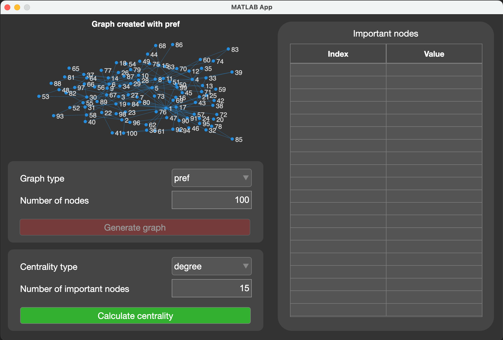
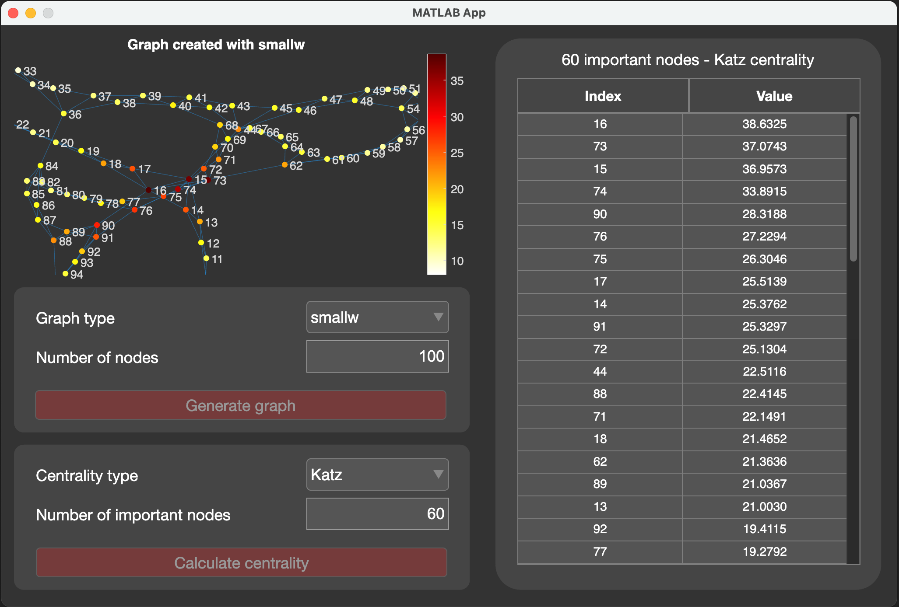

# node_centralities
A MATLAB app for generating random graphs and analyzing node centralities in complex networks.

 

This project was created on MATLAB R2024b.

## Features  
- Generate random graphs:
    - **Erdős-Rényi**
    - **Preferential Attachment**
    - **Small World**
- Compute various centrality measures:
  - **Katz centrality**  
  - **Exponential Subgraph centrality**  
  - **Degree centrality**  
  - **Closeness centrality**
  - **Betweeness centrality**
  - **Eigenvector centrality**
  - **Pagerank centrality**
- Interactive GUI with visualization and sortable results table.  

## How to Open the App  
1. Clone the repository

2. Open MATLAB and navigate to the [src/](https://github.com/Marchisceddu/node_centralities.git/src/) project folder.

3. In the MATLAB Current Folder panel, locate the file node_centralities.mlapp.

4. Double-click on node_centralities.mlapp to open it in the App Designer.

5. Click the Run button (▶) in the App Designer toolbar to launch the application.